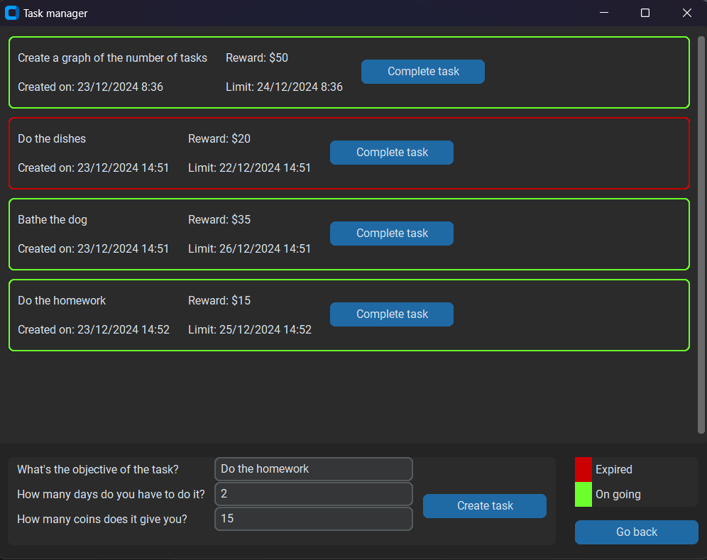

# **Life Manager**

**A productivity-enhancing life management tool designed to reduce procrastination and help you achieve your goals effectively.**

---

## **Features**
- **Task Management**: Create, track, and manage your tasks with ease.
- **Reward System**: Earn virtual coins for completing tasks, encouraging productivity.
- **Progress Visualization**: View a graphical representation of your completed tasks over time.
- **Customizable Shop**: Use earned coins to unlock rewards or tools that motivate you.
- **Modern UI**: Built with CustomTkinter for a sleek and responsive interface.

---

## **Getting Started**

### **Prerequisites**
- Python 3.8 or higher
- Required Python libraries (install using `pip`):
  - `customtkinter`
  - `matplotlib`

### **Installation**
1. Clone the repository:
   ```bash
   git clone https://github.com/yourusername/life-manager.git
   cd life-manager
   ```
2. Install dependencies:
   ```bash
   pip install -r requirements.txt
   ```
3. Run the application:
   ```bash
   python main.py
   ```

---

## **Usage**
1. Open the application.
2. Add tasks by specifying objectives, deadlines, and rewards.
3. Mark tasks as complete to earn coins.
4. Track your progress using the built-in graph.
5. Spend earned coins in the shop for motivation boosters!

---

## **Screenshots**
### Task Management Interface:

### Shop Interface:


---

## **Technologies Used**
- **CustomTkinter**: For a modern and user-friendly UI.
- **Matplotlib**: For generating progress graphs.
- **Datetime**: To handle the dates.
- **SQLite**: To save the tasks.
- **JSON**: To store task data persistently.
- **OS**: To create correct directories.

---

## **Contributing**
Contributions are welcome! To get started:
1. Fork the repository.
2. Create a feature branch:
   ```bash
   git checkout -b feature-name
   ```
3. Commit your changes:
   ```bash
   git commit -m "Add new feature"
   ```
4. Push to your branch:
   ```bash
   git push origin feature-name
   ```
5. Open a pull request.

---

## **License**
This project is licensed under the [MIT License](LICENSE).

---

## **Acknowledgments**
- Inspired by productivity techniques like **gamification** and **time blocking**.
- Special thanks to contributors and testers for their feedback and support.

---

## **Contact**
This project was my first one, so if you have any suggestion for me, you can contact me in the ways below, I would be really grateful for the help.
- **Email**: gabrielsomacaldalmolin@gmail.com
- **GitHub**: [@Gabriel-Dalmolin](https://github.com/gabriel-dalmolin)
